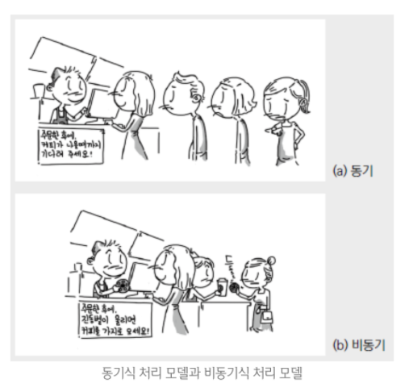

#### 1-1. 동기와 비동기
> <strong>동기(Synchronous)</strong> : 어떤 일을 진행할 때 순차적으로 기다리면서 진행하는 것
> ###### 동작원리
> 1. 코드가 실행되면 순서대로 Call Stack에 실행할 함수가 쌓인다.(push)
> 2. 쌓인 반대 순서로 함수가 실행된다.(LIFO)
> 3. 실행이 된 함수는 Call Stack에서 제거된다(pop)

<p style="width:400px; margin:0 auto">
    
</p>

> <strong>비동기(asynchronous)</strong> : 병렬적으로 동시에 여러가지 일을 처리하는 것(효율적이지만 매우 복잡)
>  ###### 동작원리
> 1. 콜스택에서 코드가 하나씩 동기적으로 순서대로 처리되는 와중에 브라우저가 제공하는 API(setTimeout)이나 네트워크 통신(ajax) 같이 시간이 오래 걸리는 코드들은 처리하지 않고 web APIs로 빼둔다.
> 2. 콜스택의 코드들의 작업이 모두 끝나고 지워져 콜스택이 텅텅 비게 된다.
> 3. 그러면 webAPIs에 모인 코드들의 콜백함수들을 콜백큐에 넣는다. 
> 4. 그러면 이벤트 루프가 콜백큐의 콜백함수들을 콜백큐에 하나씩 넣어서 콜백함수들의 결과값을 반환한다.
> <details>
> <summary><b>이벤트 루프란?</b></summary>
> <div>Event Loop는 Call Stack과 Callback Queue의 상태를 체크하여,Call Stack이 빈 상태가 되면, Callback Queue의 첫번째 콜백을 Call Stack으로 밀어넣는다.이러한 반복적인 행동을 틱(tick) 이라 부른다.</div>
> </details>

##### 예시
<p align="center">
    
</p>

> <b>동기 방식</b>은, 손님이 주문을 하고 >> 커피가 나올 때 까지 기다려서 >> 커피를 받아야 하나의 처리가 완료된다.
> 
> <b>비동기 방식</b>은, 우선 주문을 받고 >> 손님은 커피가 나오는 순서를 신경쓰지 않고 >> 진동벨이 울리면 커피를 받는다.
> 
> => 비동기 방식에서는 첫번째 손님이 스무디를 주문하고 2,3번째 손님이 커피를 주문했다고 하면 비교적 제조가 쉽고 빠른 2,3번째 손님의 커피가 먼저 나올 수도 있다.


#### 1-2. 콜백
> 매개변수로 함수를 전달받아, 함수의 내부에서 실행하는 함수
> => 즉 함수안에서 다른 함수를 실행
```javascript
//일반 함수
function a() {
    console.log('A');
}

//익명 함수
var a = function() {
    console.log('A');
}
// => 함수가 값이다!

function slowFunc(callback){
    callback();
}

//slowFunc함수에 매개변수로 a함수를 호출
slowFunc(a);
```


---
#### 2. Package Manager(npm)
> 패키지 : 소프트웨어를 부르는 여러가지 표현 중에 하나
=> 소프트웨어를 관리해주고 생성하고 설치하고, 업데이트를 관리해주는 프로그램

[PM2 링크](https://pm2.keymetrics.io/)
> <b>npm install pm2 -g</b>
=>pm2라는 프로그램을 설치! / -g는 독립된 소프트웨어라서 이 컴퓨터 어디에서든지 사용할 수 있어야 한다!

    실행 방법 : pm2 start app.js(cmd 관리자권한에서 실행..)

- <b>pm2 moit</b> => pm2에 의해 실행되고 있는 프로그램들을 보여준다
- Q 버튼을 누르면 나갈 수 있다
- <b>pm2 list</b> => 현재 실행중인 프로세스 리스트 보기
- <b>pm2 stop main</b> => 종료하고싶은 프로세스를 (main)을 종료 


> <b>pm2 start main.js --watch</b>
    => 소스코드를 변경했을 때 자동으로 변경값이 반영되는 코드(웹에서 새로고침하면 바로 반영이 된다!)
    => <b>문제점</b> :  오류가 발생하면 보여지지 않음
        => 해결책 : pm2 log _ 실행하면 변경된 내용이나 오류를 바로 보여준다
---
#### 3. HTML-form
- form의 action : action에 작성한 곳으로 form태그 내부의 값 들을 전송
- 태그의 값들의 이름은 name 속성을 줘서 설정!
=> form 작성을 완료하고 submit버튼을 누르면 action에 작성한 곳으로 데이터를 전송
- form의 method : get, post 방식 설정
> <b>get</b> : 서버로부터 사용자가 데이터를 가져올 때 사용
> -- 전송하는 데이터 길이 제한, 
> 
> <b>post</b> : 서버에 데이터를 수정, 삭제, 생성 할 때 사용
> --데이터 길이 제한x,

---
#### 4. App 제작 글생성 Ul 만들기
> form 태그로 전송한 내역을 웹브라우저 우클릭 검사-네트워크-항목 클릭-페이로드에서 볼 수 있다.
>  <<<<폼에 작성 후 전송
> 
----
#### 5. POST 방식으로 전송된 데이터 받기
> request : 사용자가 요청할때 웹브라우저가 보낸 정보
> response : 우리가 응답할 때 우리가 웹브라우저에게 전송할 정보 
> 
</br>

- 웹브라우저가 post방식으로 데이터를 전송할 때 
- 데이터가 많으면 그 데이터를 한번에 처리하기 어려움 
- => 가져올 데이터가 있으면 body에 저장 
```javascript
request.on('data', function(data){
    body = body + data;
});       
```
</br>

- 더이상 받을 데이터가 없으면 밑에 함수 호출

```javascript
request.on('end', function(){
    var post = qs.parse(body);
    var title = post.title;
    var description = post.description;
    console.log(title);
    console.log(description);
});       
```
